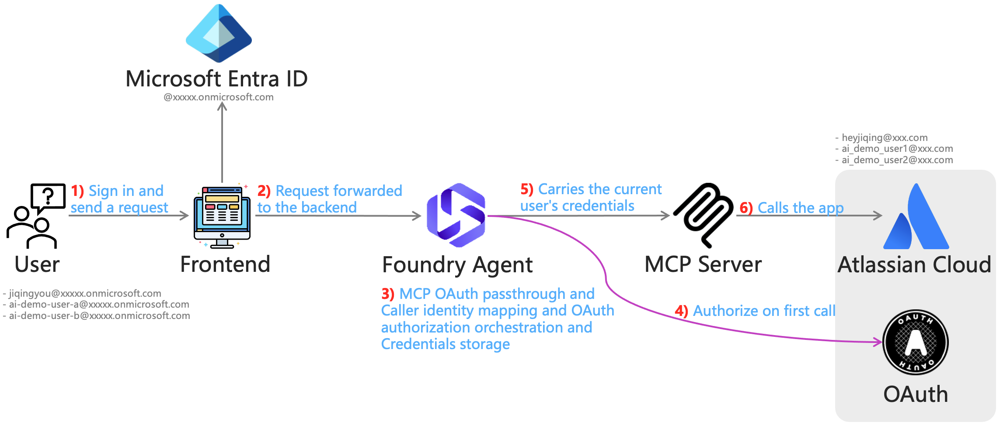

# Foundry MCP OAuth Passthrough

An end-to-end demo of **OAuth identity passthrough** for MCP tools in **Microsoft Foundry Agent Service** — the agent invokes a remote MCP server **as the signed-in user**, not as a shared service account. Users sign in with Microsoft Entra ID, consent once on first tool use, and every later tool call runs with their own credentials. The Atlassian MCP server here is just the downstream example, any OAuth-compliant MCP server works the same way.



## What It Demonstrates

- **Per-user OAuth to MCP tools**: on a user's first tool call, Foundry returns an `oauth_consent_request` with a consent link. After sign-in and consent, credentials are stored by Agent Service and reused — no re-consent on later calls.
- **Caller identity mapping end to end**: frontend Entra token → backend creates the Foundry client with the user's token → Foundry keeps consent state and credentials per real user → the downstream system (Jira/Confluence) enforces that user's permissions.
- **Human-in-the-loop tool approval**: with `require_approval` enabled, each MCP tool call surfaces an `mcp_approval_request` that the user approves or denies in the UI.
- **Re-runnable first-use flow**: a helper script recreates the MCP project connection to invalidate stored credentials, so you can demo the consent flow as many times as you want.

## How It Works

1. The user signs in with Microsoft Entra ID in the React frontend (MSAL, scope `https://ai.azure.com/.default`).
2. The frontend sends the chat message to the FastAPI backend with the user's bearer token.
3. The backend validates the JWT (signature, audience, issuer, expiry) and creates the Foundry `AIProjectClient` **with the user's token** — so consent state and stored credentials are isolated per user. It then calls the Foundry Responses API with an `agent_reference`.
4. On the user's first MCP tool call, Foundry returns an `oauth_consent_request`. The UI shows the consent link; the user completes sign-in and consent with the OAuth provider, then clicks **"I completed sign-in"**, and the backend resumes the run via `previous_response_id`.
5. Foundry calls the MCP server carrying that user's stored credentials. If `require_approval` is on, an `mcp_approval_request` is surfaced first and the backend submits the user's approve/deny decisions.
6. The MCP server calls Atlassian Cloud as the signed-in user and the agent answers from the tool results.

## Quick Start

### Prerequisites

- An Azure AI Foundry project with a model deployment
- A Microsoft Entra app registration (SPA) for the frontend sign-in
- Users in the **same tenant** as the Foundry project, with at least the **Foundry Agent Consumer** role on the project
- A remote MCP server that supports OAuth (this demo uses [mcp-atlassian](https://github.com/sooperset/mcp-atlassian) with an Atlassian OAuth 2.0 app)
- An MCP project connection in your Foundry project configured with **OAuth Identity Passthrough** (client ID/secret, auth/token/refresh URLs, scopes — include `offline_access` for auto refresh)

### Docker

The container builds the frontend, and the backend serves it and injects runtime config via `env-config.js`, production deployment only needs one container.

```bash
docker run -itd -p 8765:8765 --name FoundryMCPOAuthPassthrough \
  --restart unless-stopped \
  -e MSAL_CLIENT_ID="your-azure-ad-client-id" \
  -e AZURE_TENANT_ID="your-azure-ad-tenant-id" \
  -e FOUNDRY_PROJECT_ENDPOINT="https://your-foundry-account.services.ai.azure.com/api/projects/your-foundry-project" \
  -e FRONTEND_REDIRECT_URI="https://your-app-domain" \
  -e AGENT_NAME="FoundryAtlassianAgent" \
  ghcr.io/heyjiqingcode/foundrymcpoauthpassthrough:1.0.0
```

The app is then available at `http://localhost:8765`.

> `FRONTEND_REDIRECT_URI` must match a redirect URI registered on the Entra app; it defaults to the page's own origin when unset.\
> See [Configuration](#configuration) for every available variable.

### Local

1）Set up

```bash
# Clone code and install requirements
git clone https://github.com/HeyJiqingCode/FoundryMCPOAuthPassthrough.git
cd FoundryMCPOAuthPassthrough
source .venv/bin/activate
pip install -r requirements.txt
cd frontend && npm install && cd ..

# Copy .env.example and fill in your Entra / Foundry / MCP settings
cp .env.example .env
```

2）Create the Foundry Agent

```bash
python scripts/create_foundry_agent.py
```

> The script connects with `DefaultAzureCredential`, deletes the latest version of `AGENT_NAME` if it exists, and creates a fresh version with the configured model, reasoning effort, and the MCP tool (`server_url` + `project_connection_id` + `require_approval`).

3）Run frontend and backend separately

```bash
# Terminal 1 — frontend on http://localhost:3500
cd frontend
npm start

# Terminal 2 — backend on http://localhost:8765
uvicorn backend.foundry_agent_server:app --host 0.0.0.0 --port 8765 --reload

# Then open http://localhost:3500
```

> `frontend/start-dev.sh` loads values from the root `.env` for local CRA development.\
> See [Configuration](#configuration) for every available variable.

## Demo Walkthrough

1. Sign in with an Entra account and ask something like *"show my open Jira issues"*.
2. First MCP call → a **"Sign in required (OAuth consent)"** card appears. Open the consent link, complete the Atlassian sign-in and consent, then click **"I completed sign-in"** — the agent resumes automatically.
3. With `AGENT_MCP_REQUIRE_APPROVAL=always`, review each tool call (server, tool name, arguments) and click **"Submit approvals"**.
4. Sign in as a second user: they get their **own** consent prompt, and their results reflect their own Atlassian permissions — that's the passthrough.

## Forcing Re-Consent

Consent state lives with the MCP project connection, so recreating the connection invalidates all stored user credentials and every user is prompted again — useful for re-running the first-use demo:

```bash
# Preview the ARM payload without changing anything
python scripts/reset_mcp_project_connection.py --dry-run

# Delete and recreate the connection (backs up to .tmp/project-connection-backups first)
python scripts/reset_mcp_project_connection.py --yes
```

The script reads the existing connection via ARM, backs it up, deletes it, waits for the deletion to complete, and recreates it with the same name and ARM ID. All OAuth settings are inherited from the existing connection unless overridden by CLI flags or `MCP_OAUTH_*` environment variables.

## Configuration

| Variable | Used by | Description |
| --- | --- | --- |
| `AZURE_TENANT_ID` | backend, frontend | Entra tenant ID. Backend validates token issuer and signing keys against it. Required. |
| `MSAL_CLIENT_ID` | frontend | Client ID of the Entra app registration used for sign-in. |
| `FRONTEND_REDIRECT_URI` | frontend | MSAL redirect URI. Defaults to the page's own origin. |
| `BACKEND_URL` | frontend | Backend base URL. Defaults to the page's own origin — leave empty for the single-container deployment. |
| `CORS_ALLOWED_ORIGINS` | backend | Comma-separated allowed origins. Default: `http://localhost:3500,http://127.0.0.1:3500`. |
| `FOUNDRY_PROJECT_ENDPOINT` | backend, scripts | Foundry project endpoint. Required. |
| `AGENT_NAME` | all | Foundry Agent name. Default: `FoundryAtlassianAgent`. |
| `AGENT_MODEL` | create script | Model deployment name for the agent. |
| `AGENT_REASONING_EFFORT` | create script | Reasoning effort applied to the agent. Default: `high`. |
| `AGENT_MCP_REQUIRE_APPROVAL` | create script | `always`, `never`, or a per-tool JSON. Foundry defaults to `always` when unset. |
| `MCP_TOOL_SERVER_NAME` | scripts | MCP `server_label`, also used as the connection name fallback. |
| `MCP_TOOL_SERVER_URL` | scripts | Remote MCP server endpoint, e.g. `https://<host>/mcp`. |
| `MCP_PROJECT_CONNECTION_ID` | scripts | Full ARM resource ID of the MCP project connection. |
| `MCP_OAUTH_CLIENT_ID` / `MCP_OAUTH_CLIENT_SECRET` / `MCP_OAUTH_AUTH_URL` / `MCP_OAUTH_TOKEN_URL` / `MCP_OAUTH_REFRESH_URL` / `MCP_OAUTH_SCOPES` | reset script | Optional overrides; inherited from the existing connection when unset. |

## Notes & Limitations

- Consent is scoped **per user × per tool connection × per Foundry project** — a new user or a new connection triggers a new consent prompt.
- Include `offline_access` in the connection scopes so Agent Service can refresh tokens automatically.
- Cross-tenant token exchange is not supported: users must be in the same Entra tenant as the Foundry project.
- Agent Service supports **managed OAuth** and **custom OAuth**; this demo uses custom OAuth (bring your own OAuth app registered with the downstream service).